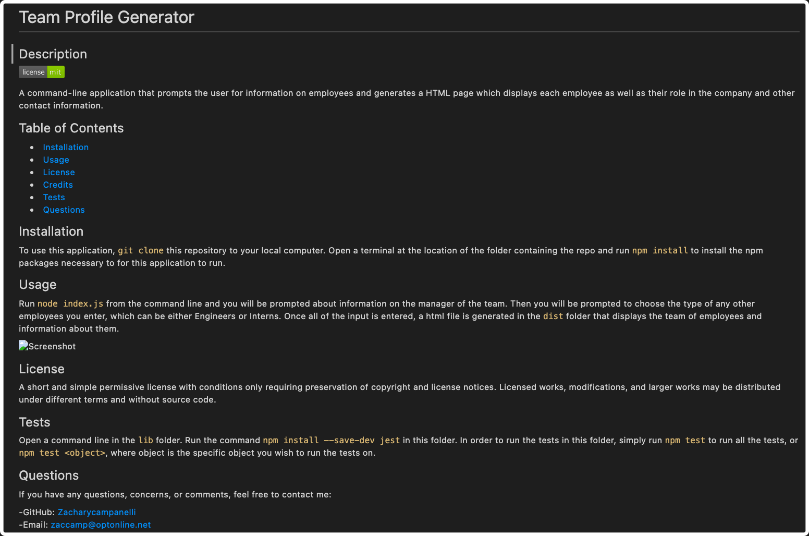
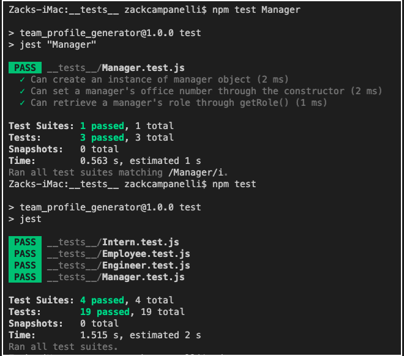

# Team Profile Generator

## Description

A command-line application that prompts the user for information on employees and generates a HTML page which displays each employee as well as their role in the company and other contact information.

## Table of Contents

- [Installation](#Installation)
- [Usage](#Usage)
- [License](#License)
- [Credits](#Credits)
- [Tests](#Tests)
- [Questions](#Questions)

## Installation

To use this application, `git clone` this repository to your local computer. Open a terminal at the location of the folder containing the repo and run `npm install` to install the npm packages necessary to for this application to run.

## Usage

Run `node index.js` from the command line and you will be prompted about information on the manager of the team. Then you will be prompted to choose the type of any other employees you enter, which can be either Engineers or Interns. Once all of the input is entered, a html file is generated in the `dist` folder that displays the team of employees and information about them.

## License

A short and simple permissive license with conditions only requiring preservation of copyright and license notices. Licensed works, modifications, and larger works may be distributed under different terms and without source code.

## Tests

Open a command line in the `lib` folder. Run the command `npm install --save-dev jest` in this folder. In order to run the tests in this folder, simply run `npm test` to run all the tests, or `npm test <object>`, where object is the specific object you wish to run the tests on.

## Questions

If you have any questions, concerns, or comments, feel free to contact me:

-GitHub: [Zacharycampanelli](https://github.com/Zacharycampanelli)  
-Email: [zaccamp@optonline.net](mailto:zaccamp@optonline.net)

## Video Tutorial
-Tutorial link: [Link to Video](https://watch.screencastify.com/v/1WEpa3B3seXkl4YjugMJ)